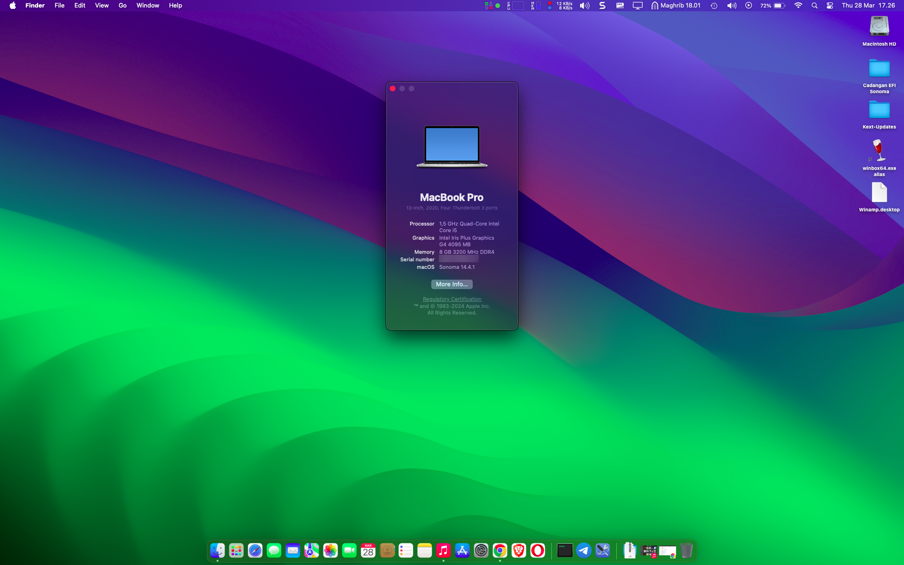
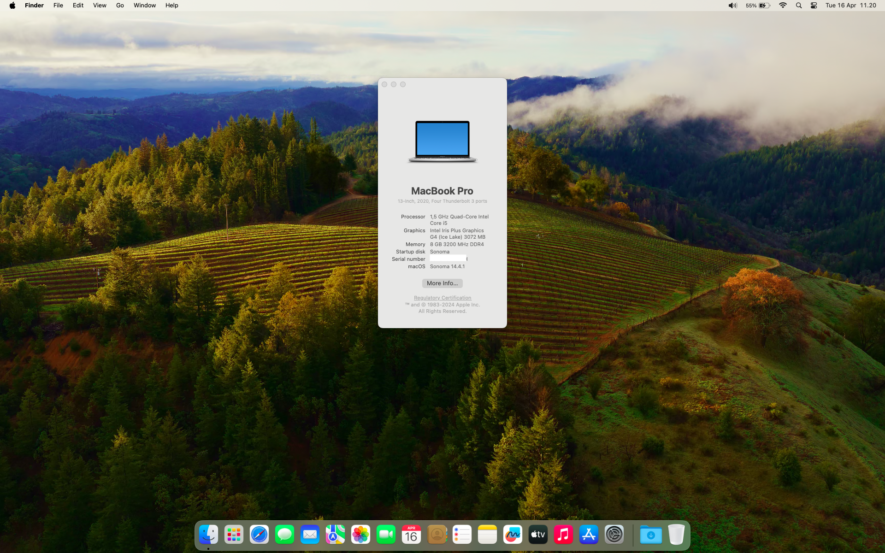
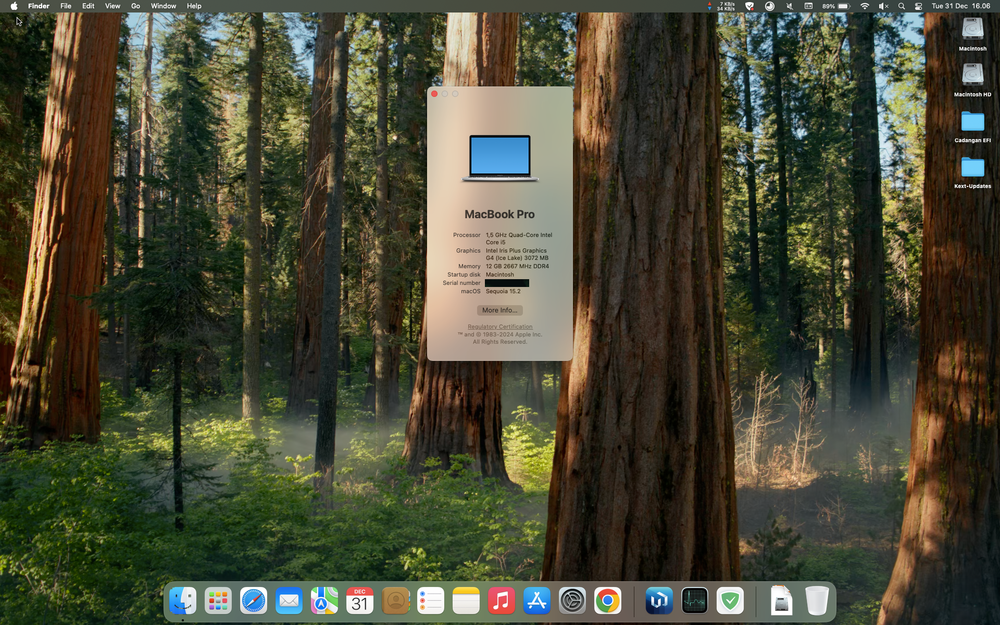
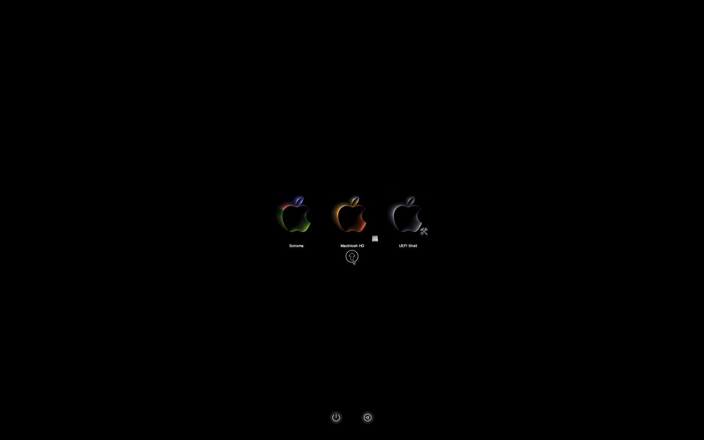
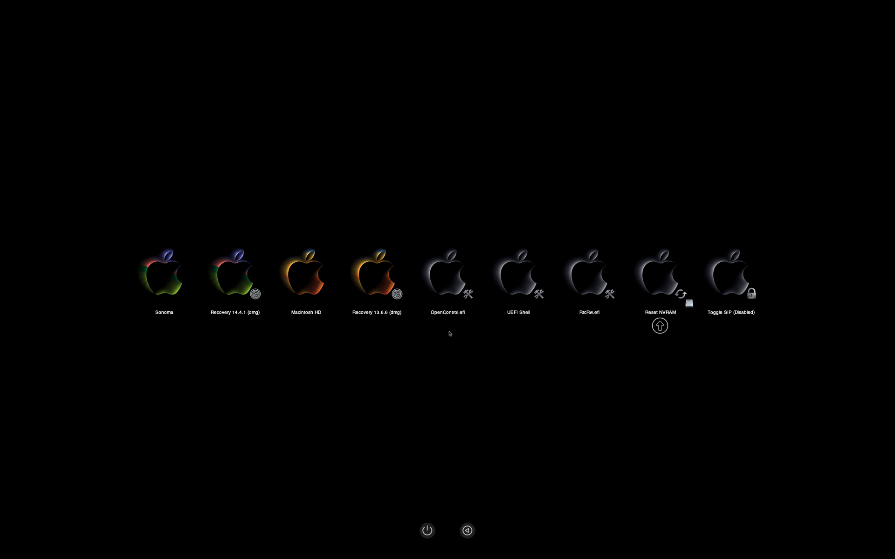

# ADVAN-Notebook-Laptop-Workpro-Intel-I5-14-FHD-Hackintosh

EFI file untuk Advan Workpro (bukan Advan Workplus)

# Catatan
> Penggunaan EFI Laptop Advan Workpro di luar tanggung jawab saya, jika ada kerusakan pemasangan silahkan tanggung jawab sendiri, saya menggunakan MacOS Sonoma, bisa di upgrade sampai MacOS sequoia.

> Revisi final EFI mendukung Ventura, Sonoma dan sequoia (lihat gambar).

> Download EFI [Disini](https://github.com/DagerDW/ADVAN-Notebook-Laptop-Workpro-Intel-I5-14-FHD-Hackintosh/tree/main/EFI).

## Bootloader
- Saya menggunakan [OpenCore 1.0.3 Mod](https://github.com/wjz304/OpenCore_NO_ACPI_Build).
- Bisa dualboot MacOS dalam satu sistem (catatan iservice hanya digunakan sistem utama saja).

## Catatan Untuk sequoia
> Download Open Core Legacy Patcher [OCLP](https://github.com/dortania/OpenCore-Legacy-Patcher).

> Tutorial Wifi dan Bluetooth Intel untuk MacOS sequoia [Klik Disini](https://github.com/OpenIntelWireless/itlwm/issues/1009#issuecomment-2499278671).

# Spesifikasi
| Spesifikasi		| Detail  |
| ----------------: | :-----  |
| Laptop | Advan Workpro Intel I5 14 FHD |
| CPU | [Ice Lake-U i5-1035G7](https://www.intel.co.id/content/www/id/id/products/sku/196592/intel-core-i51035g7-processor-6m-cache-up-to-3-70-ghz/specifications.html) Ice Lake-U |
| GPU | Intel® Iris® Plus Graphics (Intel Iris Plus Graphics G4 (Ice Lake)) |
| Penyimpanan | SSD AirDisk 256GB |
| RAM | 8 GB DDR4 2133Mhz (bisa di upgrade, tersedia 1 slot kosong) |
| Layar | 14” 16:10 FHD 1920*1200 IPS |
| Wifi | Intel Wireless-AC 9560 (saya menggunakan [airportitlwm](https://openintelwireless.github.io/itlwm/)) (catatan: perlu patch OCLP untuk MacOS sequoia) |
| Trackpad | ALPS (I2C) PoolingInterupt Mode |
| Ports | 1x USB Type C 3.2 Gen1 (PD/DP/Charger/Data), 1x USB Type C PD only, 2x USB 3.2 Gen1 & 1x USB 2.0, 1x Standard HDMI 1.4, 3,5mm Jack Audio |
| Audio | Realtek ALC269 (0x0269) (layout-id 29), saya mengupdate layout id karena mic tidak terdeteksi pada layout id 28 |

# Yang Berfungsi
| Fitur | Status |
| :---- | :----: |
| CPU power management. | ✅ | 
| Baterai. | ✅ |
| Semua port USB. | ✅ |
| Realtek ALC269  Audio (termasuk jack headphones). | ✅ |
| Wi-Fi dan Bluetooth Berfungsi dengan baik (sampai MacOS Sonoma, untuk MacOS sequoia ikuti petunjuk di atas). | ✅ |
| Internal webcam. | ✅ |
| ALPS Trackpad Berfungsi dengan baik. | ✅ |
| Screen Brightness dengan Hotkeys (Tombol F2 dan F3) tanpa Fn Mapping sendiri dari system settings > keyboard. | ✅ |
| MacOS Ventura, Sonoma dan sequoia. | ✅ |

# Sebelum Menggunakan EFI INI !!!!

- Sebelum anda menggunakan config.plist ada baiknya anda rubah bagian <b>XX-CHANGE_ME-XX</b>.
- Gunakan aplikasi [GenSMBIOS](https://github.com/corpnewt/GenSMBIOS).
- Keterangan detail ada di [README](https://github.com/DagerDW/ADVAN-Notebook-Laptop-Workpro-Intel-I5-14-FHD-Hackintosh/tree/main/EFI/OC/ACPI)

## Yang Tidak Berfungsi
- Silahkan bergabung di telegram [Hackintosh Lovers](https://t.me/HackintoshLover) untuk berdiskusi.

# Kredit
- [Apple](https://www.apple.com) for macOS.
- [Acidanthera](https://github.com/acidanthera) for most of the kexts.
- [RehabMan](https://github.com/RehabMan) for some ACPI patches.
- [Hackintosh Lovers](https://t.me/HackintoshLover) for the help.
- [Olarila](https://www.olarila.com) for guides.
- [MrMackintosh](https://mrmacintosh.com/macos-sonoma-full-installer-database-download-directly-from-apple/) for download installer link.
- Dan semua pihak yang tidak bisa kami sebutkan satu per satu.
