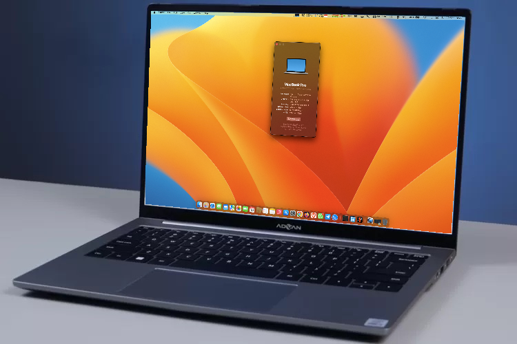
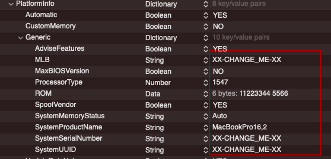

# ADVAN-Notebook-Laptop-Workpro-Intel-I5-14-FHD-Hackintosh

EFI file untuk Advan Workpro (bukan Advan Workplus)
#

# Catatan
- Penggunaan EFI Laptop Advan Workpro di luar tanggung jawab saya, jika ada kerusakan pemasangan silahkan tanggung jawab sendiri, saya menggunakan MacOS Ventura, bisa di upgrade sampai MacOS Sonoma
- Generate ulang Serial Nuber, ROM, MLB dan System UUID, gunakan [aplikasi GenSMBIOS](https://github.com/corpnewt/GenSMBIOS)

# Bootloader
Saya menggunakan [OpenCore 1.0.0 Mod](https://github.com/wjz304/OpenCore_NO_ACPI_Build)

# Spesifikasi
- <b>CPU</b>: [Ice Lake-U i5-1035G7](https://www.intel.co.id/content/www/id/id/products/sku/196592/intel-core-i51035g7-processor-6m-cache-up-to-3-70-ghz/specifications.html) Ice Lake-U
- <b>GPU</b>: Intel® Iris® Plus Graphics (Intel Iris Plus Graphics G4 (Ice Lake))
- <b>Penyimpanan</b>: SSD AirDisk 256GB
- <b>RAM</b>: 8 GB DDR4 2133Mhz (bisa di upgrade, tersedia 1 slot kosong)
- <b>Layar</b>: 14” 16:10 FHD 1920*1200 IPS
- <b>Wifi</b>: Intel Wireless-AC 9560 (saya menggunakan [airportitlwm](https://openintelwireless.github.io/itlwm/))
- <b>Trackpad</b>: ALPS (I2C) PoolingInterupt Mode
- <b>Ports</b>: 1x USB Type C 3.2 Gen1 (PD/DP/Charger/Data), 1x USB Type C PD only, 2x USB 3.2 Gen1 & 1x USB 2.0, 1x Standard HDMI 1.4, 3,5mm Jack Audio
- <b>Audio</b>: Realtek ALC269 (0x0269) (layout-id 28)

# Yang Berfungsi
- CPU power management. 
- Baterai.
- Semua port USB.
- Realtek ALC269  Audio (termasuk jack headphones).
- Wi-Fi dan Bluetooth Berfungsi dengan baik.
- Internal webcam.
- ALPS Trackpad Berfungsi dengan baik.
- Screen Brightness dengan Hotkeys (Tombol F2 dan F3) tanpa Fn.
- Kunci Fn.
- MacOS Ventura, Sonoma.

# Sebelum Menggunakan EFI INI !!!!

- Sebelum anda menggunakan config.plist ada baiknya anda rubah bagian <b>XX-CHANGE_ME-XX</b>.
- Gunakan aplikasi [GenSMBIOS](https://github.com/corpnewt/GenSMBIOS).

## Yang Tidak Berfungsi
- Silahkan bergabung di telegram [Hackintosh Lovers](https://t.me/HackintoshLover) untuk berdiskusi.

# Kredit
- [Apple](https://www.apple.com) for macOS.
- [Acidanthera](https://github.com/acidanthera) for most of the kexts.
- [RehabMan](https://github.com/RehabMan) for some ACPI patches.
- [Hackintosh Lovers](https://t.me/HackintoshLover) for the help.
- [Olarila](https://www.olarila.com) for guides.
- Dan semua pihak yang tidak bisa kami sebutkan satu per satu.
